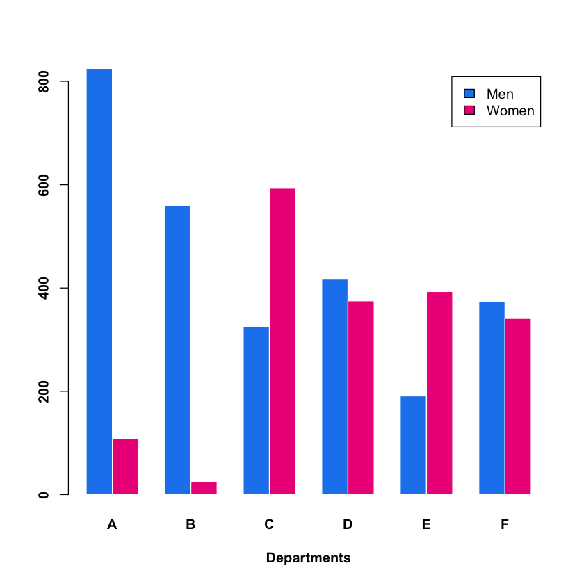

# Is UCBerkeley discriminating against women?

University of California, Berkeley is being sued because the prosecution claims that the university is discriminating against women who apply to graduate school. They claim that the admission rate for men is higher than that of women. I have been task to analyse the data and present my findings to the Jury. Based on what I found, the answer might surprise you. Let me explain.


```R
#UCBAdmissions is a 3-dimensional array resulting from
#cross-tabulating 4526 observations on 3 varaibles
#The variables and their levels are as follows:
#No Name   Levels
# 1 Admit  Admitted, Rejected
# 2 Gender Male, Female
# 3 Dept   A, B, C, D, E, F
A_to_B <- UCBAdmissions[,,'A'] + UCBAdmissions[,,'B']
B_to_C <- UCBAdmissions[,,'C'] + UCBAdmissions[,,'D']
D_to_E <- UCBAdmissions[,,'E'] + UCBAdmissions[,,'F']
Total_Admissions_Data <- A_to_B + B_to_C + D_to_E
```

The above code, combines all data from each department while preserving the row and column names. From the Total_Admission_Data we can get the following pie chart.


```R
admitted_female_applicants <- Total_Admissions_Data['Admitted','Female']
female_applicants <- sum(Total_Admissions_Data[,'Female'])

admit_rate_fem <- admitted_female_applicants / female_applicants

admitted_male_applicants <- Total_Admissions_Data['Admitted','Male']
male_applicants <- sum(Total_Admissions_Data[,'Male'])

admit_rate_mal <- admitted_male_applicants / male_applicants

print(c("Admission Rate for Women %: ", round(admit_rate_fem, 3) * 100))
print(c("Admission Rate for Men %  : " ,round(admit_rate_mal, 3) * 100))

#For the whole of UCBerkeley, Women have an admission rate of 30%
#while men have an admission rate of 45%
par(mfrow = c(1,2))
Fem_Title <- 'Female Applicants in \n UCBerkeley\'s Admission  \n Pool'
Mal_Title <- 'Male Applicants in \n UCBerkeley\'s Admission \n Pool'

colors_fem <- c("deeppink4", "deeppink")
colors_mal <- c("dodgerblue4", "dodgerblue")
pie(Total_Admissions_Data[,'Female'], main = Fem_Title, col = colors_fem)
pie(Total_Admissions_Data[,'Male'], main = Mal_Title, col = colors_mal)
```

    [1] "Admission Rate for Women %: " "30.4"                        
    [1] "Admission Rate for Men %  : " "44.5"                        


From the above, we can infer that more men are admitted to UC Berkeley than women. To understand why, we need to know how admissions work. If an applicant applies to UCBerkeley, his/her application gets sent to the departmant of their choice, and then the department themselve makes the decision wheter or not they will admit the applicant. Intuitively, we would blame the departments for discrimination but the question is which one. Lets examine each department.


```R
Department_A = UCBAdmissions[,,'A']

admitted_female_applicants <- Department_A['Admitted','Female']
female_applicants <- sum(Department_A[,'Female'])

admit_rate_fem <- admitted_female_applicants / female_applicants

admitted_male_applicants <- Department_A['Admitted','Male']
male_applicants <- sum(Department_A[,'Male'])

admit_rate_mal <- admitted_male_applicants / male_applicants

print(c("Admission Rate for Women %: ", round(admit_rate_fem, 3) * 100))
print(c("Admission Rate for Men %  : " ,round(admit_rate_mal, 3) * 100))

#For department A, Women have an admission rate of 82%
#while men have an admission rate of 62%

par(mfrow = c(1,2))
Fem_Title <- 'Female Applicants in \n Department A'
Mal_Title <- 'Male Applicants in \n Department A'
pie(Department_A[,'Female'], main = Fem_Title, col = colors_fem)
pie(Department_A[,'Male'], main = Mal_Title, col = colors_mal)
```

    [1] "Admission Rate for Women %: " "82.4"                        
    [1] "Admission Rate for Men %  : " "62.1"                        


In department A, the admission rate is higher for women than men. Let's try department B.


```R
Department_B = UCBAdmissions[,,'B']

admitted_female_applicants <- Department_B['Admitted','Female']
female_applicants <- sum(Department_B[,'Female'])

admit_rate_fem <- admitted_female_applicants / female_applicants

admitted_male_applicants <- Department_B['Admitted','Male']
male_applicants <- sum(Department_B[,'Male'])

admit_rate_mal <- admitted_male_applicants / male_applicants

print(c("Admission Rate for Women %: ", round(admit_rate_fem, 3) * 100))
print(c("Admission Rate for Men %  : " ,round(admit_rate_mal, 3) * 100))

#For department B, Women have an admission rate of 68%
#while men have an admission rate of 63%

par(mfrow = c(1,2))
Fem_Title <- 'Female Applicants in \n Department B'
Mal_Title <- 'Male Applicants in \n Department B'
pie(Department_B[,'Female'], main = Fem_Title, col = colors_fem)
pie(Department_B[,'Male'], main = Mal_Title, col = colors_mal)
```

    [1] "Admission Rate for Women %: " "68"                          
    [1] "Admission Rate for Men %  : " "63"                          


In department B, the admission rate is higher for women than men. What about department C?


```R
Department_C = UCBAdmissions[,,'C']

admitted_female_applicants <- Department_C['Admitted','Female']
female_applicants <- sum(Department_C[,'Female'])

admit_rate_fem <- admitted_female_applicants / female_applicants

admitted_male_applicants <- Department_C['Admitted','Male']
male_applicants <- sum(Department_C[,'Male'])

admit_rate_mal <- admitted_male_applicants / male_applicants

print(c("Admission Rate for Women %: ", round(admit_rate_fem, 3) * 100))
print(c("Admission Rate for Men %  : " ,round(admit_rate_mal, 3) * 100))

#For department C, Women have an admission rate of 34%
#while men have an admission rate of 37%

par(mfrow = c(1,2))
Fem_Title <- 'Female Applicants in \n Department C'
Mal_Title <- 'Male Applicants in \n Department C'
pie(Department_C[,'Female'], main = Fem_Title, col = colors_fem)
pie(Department_C[,'Male'], main = Mal_Title, col = colors_mal)
```

    [1] "Admission Rate for Women %: " "34.1"                        
    [1] "Admission Rate for Men %  : " "36.9"                        


In department C, the admission rates for both men and women are roughly the same, but for women it is slightly lower than men.


```R
Department_D = UCBAdmissions[,,'D']

admitted_female_applicants <- Department_D['Admitted','Female']
female_applicants <- sum(Department_D[,'Female'])

admit_rate_fem <- admitted_female_applicants / female_applicants

admitted_male_applicants <- Department_D['Admitted','Male']
male_applicants <- sum(Department_D[,'Male'])

admit_rate_mal <- admitted_male_applicants / male_applicants

print(c("Admission Rate for Women %: ", round(admit_rate_fem, 3) * 100))
print(c("Admission Rate for Men %  : " ,round(admit_rate_mal, 3) * 100))

#For department D, Women have an admission rate of 35%
#while men have an admission rate of 33%

par(mfrow = c(1,2))
Fem_Title <- 'Female Applicants in \n Department D'
Mal_Title <- 'Male Applicants in \n Department D'
pie(Department_D[,'Female'], main = Fem_Title, col = colors_fem)
pie(Department_D[,'Male'], main = Mal_Title, col = colors_mal)
```

    [1] "Admission Rate for Women %: " "34.9"                        
    [1] "Admission Rate for Men %  : " "33.1"                        


In department D, the admission rates for both men and women are roughly the same, but for women it is a bit higher.


```R
Department_E = UCBAdmissions[,,'E']

admitted_female_applicants <- Department_E['Admitted','Female']
female_applicants <- sum(Department_E[,'Female'])

admit_rate_fem <- admitted_female_applicants / female_applicants

admitted_male_applicants <- Department_E['Admitted','Male']
male_applicants <- sum(Department_E[,'Male'])

admit_rate_mal <- admitted_male_applicants / male_applicants

print(c("Admission Rate for Women %: ", round(admit_rate_fem, 3) * 100))
print(c("Admission Rate for Men %  : " ,round(admit_rate_mal, 3) * 100))

#For department E, Women have an admission rate of 24%
#while men have an admission rate of 28%

par(mfrow = c(1,2))
Fem_Title <- 'Female Applicants in \n Department E'
Mal_Title <- 'Male Applicants in \n Department E'
pie(Department_E[,'Female'], main = Fem_Title, col = colors_fem)
pie(Department_E[,'Male'], main = Mal_Title, col = colors_mal)
```

    [1] "Admission Rate for Women %: " "23.9"                        
    [1] "Admission Rate for Men %  : " "27.7"                        


In department E, the admission rates for both men and women are roughly the same, but for women it is a bit lower than men.


```R
Department_F = UCBAdmissions[,,'F']

admitted_female_applicants <- Department_F['Admitted','Female']
female_applicants <- sum(Department_F[,'Female'])

admit_rate_fem <- admitted_female_applicants / female_applicants

admitted_male_applicants <- Department_F['Admitted','Male']
male_applicants <- sum(Department_F[,'Male'])

admit_rate_mal <- admitted_male_applicants / male_applicants

print(c("Admission Rate for Women %: ", round(admit_rate_fem, 3) * 100))
print(c("Admission Rate for Men %  : " ,round(admit_rate_mal, 3) * 100))

#For department E, Women have an admission rate of 7%
#while men have an admission rate of 6%

par(mfrow = c(1,2))
Fem_Title <- 'Female Applicants in \n Department F'
Mal_Title <- 'Male Applicants in \n Department F'
pie(Department_F[,'Female'], main = Fem_Title, col = colors_fem)
pie(Department_F[,'Male'], main = Mal_Title, col = colors_mal)
```

    [1] "Admission Rate for Women %: " "7"                           
    [1] "Admission Rate for Men %  : " "5.9"                         


In department F, the admission rates for both men and women are roughly the same, but for women it is a bit higher than men.

From this, the University as a whole seem to have lower admission rates for women compared to men, but there are four departments in UC Berkely that have higher or slightly admissions rate for women than men (A, B, D, and F). Moreover, there are only two departments where women have a slightly lower or similar admission rate comparted to men (C, and E).


Why?


To answer that question, we need to analyse the distribution of male and female applicants in UC Berkeley's admissions pool. Then we will analyse the distribution of male and female applicants in each department.


```R
Num_Men <- sum(Total_Admissions_Data[, 'Male'])     #2691
Num_Wom <- sum(Total_Admissions_Data[, 'Female'])   #1835

Num_Men_A <- sum(Department_A[,'Male'])             #825
Num_Wom_A <- sum(Department_A[,'Female'])           #108

Num_Men_B <- sum(Department_B[,'Male'])             #560
Num_Wom_B <- sum(Department_B[,'Female'])           #25

Num_Men_C <- sum(Department_C[,'Male'])             #325
Num_Wom_C <- sum(Department_C[,'Female'])           #593

Num_Men_D <- sum(Department_D[,'Male'])             #417
Num_Wom_D <- sum(Department_D[,'Female'])           #357

Num_Men_E <- sum(Department_E[,'Male'])             #191
Num_Wom_E <- sum(Department_E[,'Female'])           #393

Num_Men_F <- sum(Department_F[,'Male'])             #373
Num_Wom_F <- sum(Department_F[,'Female'])           #341

colors <- c('dodgerblue2', 'deeppink2')
title <- "Distribution of UC Berkeley's \n Applicants by Gender"
barplot(c(Num_Men, Num_Wom), col = colors,
        main = title, legend = c('Male applicants', 'Female applicants'),
        font.axis = 2)


```


As you can see from above, there are more applicants than female applicants so lets break it down by department.


```R
entries <- c(Num_Men_A, Num_Wom_A,
             Num_Men_B, Num_Wom_B,
             Num_Men_C, Num_Wom_C,
             Num_Men_D, Num_Wom_D,
             Num_Men_E, Num_Wom_E,
             Num_Men_F, Num_Wom_F)
data = matrix(entries , nrow = 2)
colnames(data) = c("A","B","C","D", "E", "F")
rownames(data) = c("Men","Women")
 
# Grouped barplot
colors <- c('dodgerblue2', 'deeppink2',
           'dodgerblue2', 'deeppink2',
           'dodgerblue2', 'deeppink2',
           'dodgerblue2', 'deeppink2',
           'dodgerblue2', 'deeppink2',
           'dodgerblue2', 'deeppink2')
barplot(data, col = colors , 
        border = "white", font.axis = 2, beside = T, 
        legend = rownames(data), xlab = "Departments", 
        font.lab = 2)
```





Departments A, B, D, and F have more male applicants than female applicants while departments C, and E have more female applicants than male applicants. From the previous analyses, the departments that have more male applicants tend to have higher acceptance rates for women, while the departments that have more female applicants have a slightly higher rejection rates. From this bar graph, we can infer that most women are applying to departments that would lead to rejections.

To conclude, I don't think that UC Berkeley is trying discriminate against women. The reason why there seems to be discrimination against women is because of the uneven distribution of applicants in each department.


```R

```
